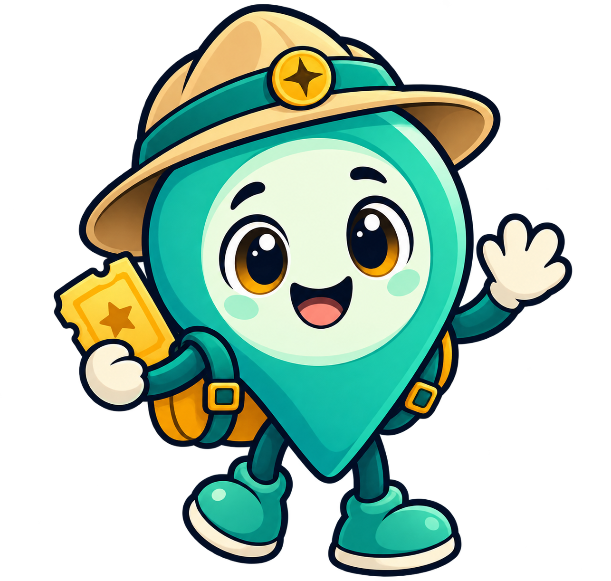
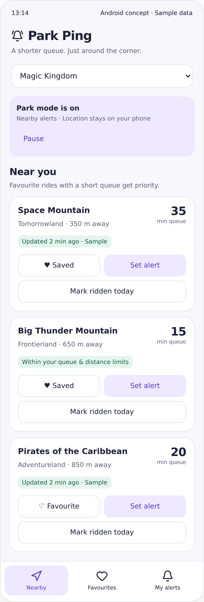
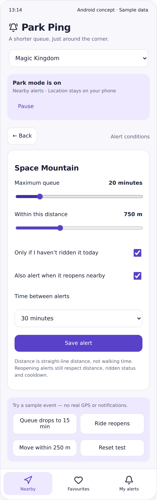
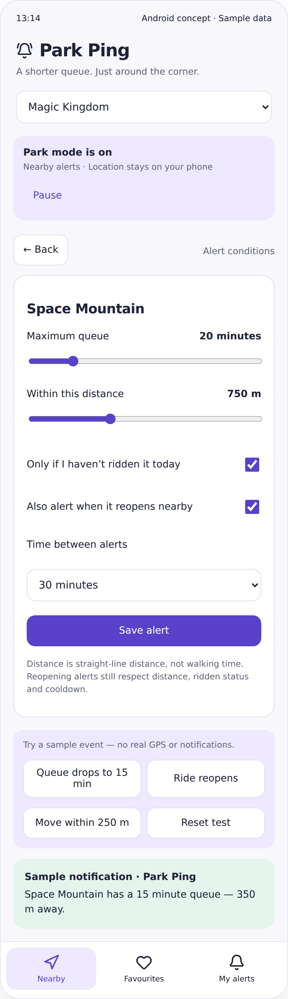

# Park Ping

### A shorter queue. Just around the corner.

Spend more of your park day enjoying the rides. Park Ping watches your favourite attractions and lets you know when a nearby ride has a queue within your chosen limit, or reopens.

**[Download the Android test app](https://github.com/davidcollom/park-ping/releases)** · **[Follow the Google Play launch](https://github.com/davidcollom/park-ping/issues/11)**

Currently available as an early Android test build. Google Play publication is on the roadmap.

## Your park day, your rules

- **Choose your queue limit.** Set the longest posted wait you’re happy with for each ride.
- **Stay nearby.** Pick a distance radius so your alerts fit where you are in the park.
- **Save your favourites.** Keep the rides you care about together.
- **Make room for something new.** Mark rides as done and optionally skip them for the rest of the day.
- **Catch a reopening.** Get a ping after a nearby ride comes back from a temporary downtime.
- **Set the pace.** Choose a cooldown between alerts, and pause Park mode whenever you like.

Distances are measured in a straight line, rather than along park paths. Posted waits can change before you arrive.

## Take a look

These screenshots are from the interactive design mock-up, using **sample data**. They show the intended experience; the native Android test build may look different. They are not final Play Store screenshots.

| Nearby rides | Your alert controls | A sample ping |
| --- | --- | --- |
|  |  |  |

The location-pin scout above now appears in the Android launcher, app header and empty states. Candidate Play artwork is in [docs/store-assets](docs/store-assets); the identity still needs Dave's review before publication.

## Try it on your phone

1. Download **park-ping.apk** from a [signed test release](https://github.com/davidcollom/park-ping/releases).
2. Open it on your Android phone. If prompted, allow Files or your browser to install it.
3. Pick a park, choose a ride and save your alert conditions.
4. Tap **Start Park mode** and allow location and notifications.
5. Pause from the app, or stop Park mode from its ongoing notification.

You can try **Send test notification** at home. It’s labelled as an example and does not mean a ride is nearby. Park Ping supports Android 8.0 and later.

If you installed the original development-key build, switching to the signed release requires uninstalling that build first, which removes its saved settings. Updates signed with the same release key can preserve your settings.

## Parks you can explore

**Walt Disney World:** Magic Kingdom, EPCOT, Hollywood Studios and Animal Kingdom.

**Disneyland Paris:** Disneyland Park and Walt Disney Studios Park (the name shown in this test build).

**Universal Orlando:** Universal Studios Florida, Islands of Adventure and Epic Universe.

Availability and wait times depend on the live data feed.

## Location stays on your phone

Park Ping uses your location on your device to calculate ride distances. It does not send your coordinates to the park-data provider. The app has no account system or analytics SDKs.

Live data requests use park IDs and expose normal network information such as your IP address. Monitoring starts when you switch on Park mode, with an ongoing notification and a stop control. Android battery settings may delay checks or stop monitoring.

## Help shape the first release

Found a problem? [Open an issue](https://github.com/davidcollom/park-ping/issues/new) with your app version, Android version, selected park and what happened. Please keep passwords and signing keys private.

The [Google Play launch tracker](https://github.com/davidcollom/park-ping/issues/11) covers the mascot, real app screenshots, accessibility, device testing, privacy information and release preparation. Store copy is drafted in [docs/STORE-LISTING.md](docs/STORE-LISTING.md).

For building or maintaining the app, see [the developer guide](docs/DEVELOPING.md) and [the signing guide](SIGNING.md).

Ride data is provided by [ThemeParks.wiki](https://themeparks.wiki). Park Ping is an independent app, unaffiliated with Disney, Universal or ThemeParks.wiki.
